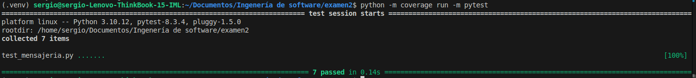
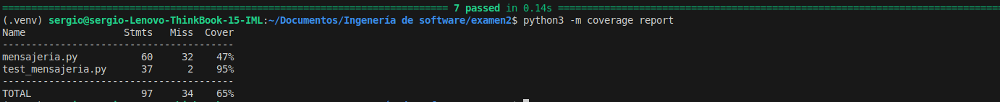

# examen2IS
Examen 2 de ingenería de software
1. Agregar contacto : 

python3 -m coverage run      
Output:      

python3 -m coverage report      
Output:      

3. Cambios sugeridos :
    Agergar los métodos eliminar contacto y usuario
    tener una variable que sea el limite de contactos que pueda tener una persona.
   
Cuánto riesgo hay de “romper” lo que ya funciona?

. Si se elimina un usuario, se debe asegurar que la eliminación no afecte los mensajes que se haya enviado a otros de sus contactos
